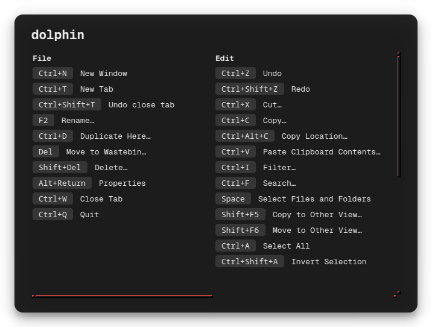
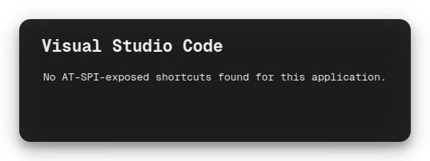

# KheetSheet

A KDE Plasma clone of the Mac app "Cheatsheet": press a hotkey, see the focused
app's keyboard shortcuts in an overlay, grouped by menu. Shortcut data comes
entirely from AT-SPI (the accessibility tree) — no hand-maintained per-app
database. If an app doesn't expose its menu via AT-SPI (many GTK4/Electron
apps), you'll get an honest "no shortcuts found" instead of stale or
fabricated data.

## Screenshots

Real output, captured live against running apps.

| Real shortcuts (Dolphin) | App with no AT-SPI menu (VS Code) |
| --- | --- |
|  |  |

## Supported systems

Any KDE Plasma 6 desktop. Distro-specific install steps:

- **Kubuntu / Debian / Ubuntu-based** — this page.
- **Bazzite / Fedora Atomic** — see [BAZZITE-README.md](BAZZITE-README.md).

## Install (Kubuntu/Debian/Ubuntu-based Plasma 6)

### 1. Install dependencies

```
sudo apt install python3-pyqt6 python3-dbus python3-dbus.mainloop.pyqt6 \
    python3-gi gir1.2-atspi-2.0 kpackagetool6 libkf6config-bin qdbus-qt6
```

These are all standard KDE/Plasma 6 packages, nothing project-specific.
`install.sh` checks for them by the binaries/Python modules they provide (not
the package names) and tells you exactly what's missing rather than
installing anything itself — it won't get partway through and leave things in
a broken state.

### 2. Run the installer

```
./install.sh
```

This installs the KWin active-window watcher script and the
`kheetsheet-daemon` systemd user service, and starts the daemon immediately.
Accessibility (AT-SPI) is enabled by the daemon itself at every startup via
`org.a11y.Status.IsEnabled` — see [the note below](#a-note-on-enabling-accessibility)
for why that's *not* done via `kaccessrc`.

### 3. Bind the global shortcut (manual step)

`kglobalaccel` only registers command shortcuts through its own D-Bus
registration protocol, not by reading files off disk — a plain `.desktop`
file + `kglobalshortcutsrc` entry gets silently discarded on the next login
(confirmed the hard way, see [the note below](#a-note-on-kglobalaccel)). So
this one step has to be done through the GUI:

1. Open **System Settings → Shortcuts**.
2. Click **"Add New"** (top right) → **"Command or Script"**.
3. Name it "KheetSheet", set your preferred trigger key, and set the command to:
   ```
   gdbus call --session --dest com.kheetsheet.Daemon --object-path /KheetSheet --method com.kheetsheet.Daemon.Toggle
   ```
4. Click **Apply**.

Double-check the key that actually lands in the trigger field before saving —
it can end up different from what you pressed if the recording widget catches
extra held modifiers.

### 4. Try it

Press your bound shortcut over any Qt/KDE app (Dolphin, Kate, Konsole, ...).
Press it again (or Esc) to dismiss.

On a non-apt distro not covered by a dedicated guide (Arch, etc.), just run
`./install.sh` — it'll tell you exactly which binaries/modules it couldn't
find, which you can then map to that distro's package names.

## Updating

1. **If you previously downloaded a `.zip`, delete that old extracted folder
   first.** Grabbing a fresh copy alongside an old one just leaves two copies
   lying around — only one is ever wired up to actually run, and it's easy to
   lose track of which. (If you cloned with `git` instead, skip this — just
   `git pull` in the same folder.)
2. Get the new version (fresh `.zip` extract, or `git pull`).
3. Run `./install.sh` again from the new copy.

`install.sh` re-checks dependencies (skips anything already satisfied),
reinstalls the KWin script and systemd service, and always restarts the
daemon — even if it was already running — so an update takes effect
immediately instead of silently waiting for your next login. If it notices
the systemd service previously pointed at a *different* directory (meaning
you ran it from a new location rather than updating in place), it'll say so
at the end and name the old directory, since that one's now safe to delete.

## Usage

Press your bound shortcut to show the current app's shortcuts; press it again
(or Esc) to dismiss.

## Architecture

- **`daemon/`** — a Python D-Bus service (`com.kheetsheet.Daemon` at
  `/KheetSheet`) that walks AT-SPI's accessible tree for the active app and
  renders a translucent overlay (PyQt6) of its real shortcuts. Runs under
  `QT_QPA_PLATFORM=xcb` — under KWin/Wayland, a native Qt-Wayland window
  doesn't honor always-on-top or absolute positioning, so the overlay runs as
  an XWayland client instead, where both work correctly.
- **`kwin-script/`** — a KWin script watching active-window changes, reporting
  them to the daemon via `NotifyActiveWindow`.
- **`systemd/kheetsheet-daemon.service`** — the installed user unit (a
  template; `install.sh` writes the real one with the correct path baked in).
- **`install.sh`** — installs both of the above; the global shortcut is a
  manual step (see Install section).

## Known limitations

- Only apps that expose their menu via AT-SPI will show anything. Traditional
  Qt/KDE apps (Dolphin, Kate, Konsole, ...) generally work well. Many GTK4 apps
  (header-bar-only, no traditional menu bar) and Electron apps expose little or
  nothing — the overlay will say so rather than guess.
- Flatpak apps are matched by pid first, falling back to matching the AT-SPI
  app's name against the window's `resourceClass` — needed because every
  Flatpak app's D-Bus traffic goes through a per-instance `xdg-dbus-proxy`,
  so AT-SPI sees the proxy's pid for a window rather than the real app's.
  This recovers real shortcut data for Flatpak apps that expose a normal
  menu, but some (Firefox among them) only populate a given submenu's
  accessible items after it's been opened at least once in the running
  session — those show as empty until you've clicked into each menu manually.
- Snap-confined apps may be blocked by AppArmor from querying other apps'
  accessible trees (observed with the VS Code snap querying Vivaldi's snap) —
  this doesn't affect the daemon querying non-snap apps.
- If you're re-running `install.sh` from inside a **snap-confined terminal**
  (e.g. one launched from VS Code's snap package), be aware `XDG_DATA_HOME`
  may be redirected to that snap's private directory — the installer detects
  and corrects for this automatically, but it's worth knowing about if you're
  debugging by hand outside the script.
- Verified on Kubuntu/Plasma 6.6/Wayland and on Bazzite (Fedora Atomic) —
  see [BAZZITE-README.md](BAZZITE-README.md) for the Fedora-specific notes.

## A note on enabling accessibility

Don't set `kwriteconfig6 --file kaccessrc --group ScreenReader --key Enabled
true` to get AT-SPI working. That key isn't a lightweight "turn on the
accessibility bus" flag — it's the literal switch KDE uses to autostart Orca,
the real speaking screen reader, at every login (learned this the hard way:
it made Orca launch and start reading the screen out loud every session).
The bus-level flag apps actually need (`org.a11y.Status.IsEnabled`) is
separate and much lighter weight — the daemon sets that directly on its own
D-Bus session bus at startup (`ensure_accessibility_enabled()` in
`daemon/service.py`), which is sufficient on its own and doesn't touch Orca
at all. If you ever want Orca off after having turned this on, `kwriteconfig6
--file kaccessrc --group ScreenReader --key Enabled false` and kill any
running `orca` process.

## A note on kglobalaccel

Two dead ends worth not repeating:

- **Don't try to fully automate registration by writing a `.desktop` file +
  `kglobalshortcutsrc` entry directly.** It looks like it should work (the
  fields match exactly what the GUI writes), but `kglobalaccel` doesn't
  passively trust config files — it only recognizes shortcuts registered
  through its real protocol, and silently discards the rest on its next
  startup, even after a full reboot and a `kbuildsycoca6` cache rebuild.
  Confirmed this by staging the entry, rebooting, and finding it gone. The
  "Add New" GUI flow is the one path known to work, because it calls the
  registration protocol correctly.
- **Don't hand-craft raw `setForeignShortcutKeys`/`doRegister` D-Bus calls
  against `org.kde.kglobalaccel` to try to script that protocol yourself
  instead.** In Plasma 6, `kglobalaccel` runs in-process inside
  `kwin_wayland`, and a malformed call there crashed the entire compositor
  (KWin's crash-restart supervisor recovered the session, but it's not a risk
  worth taking).

Net effect: the global shortcut is a manual, GUI-only step. `install.sh`
doesn't attempt it.
