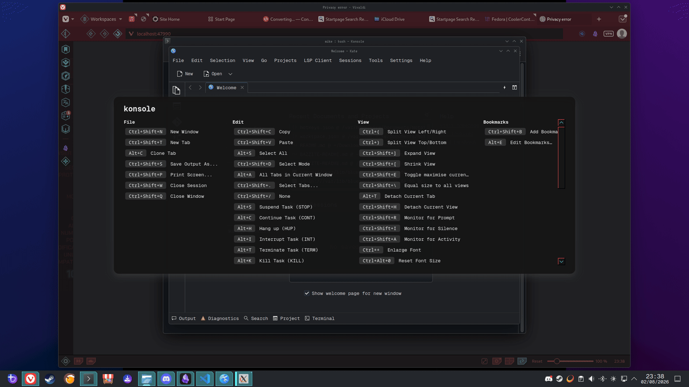
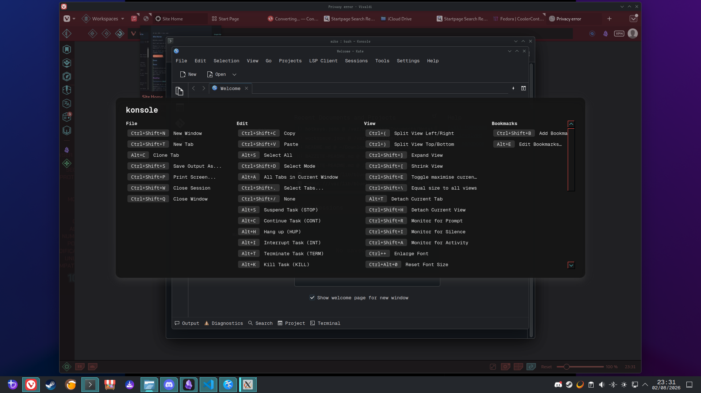
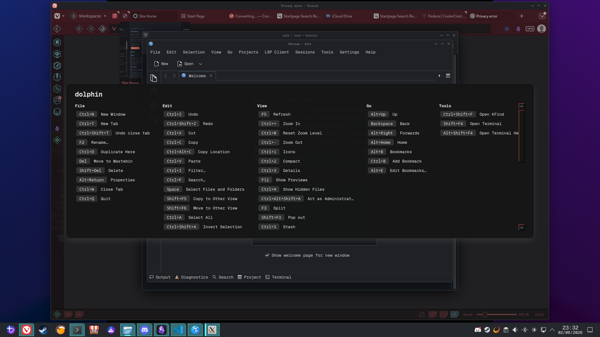
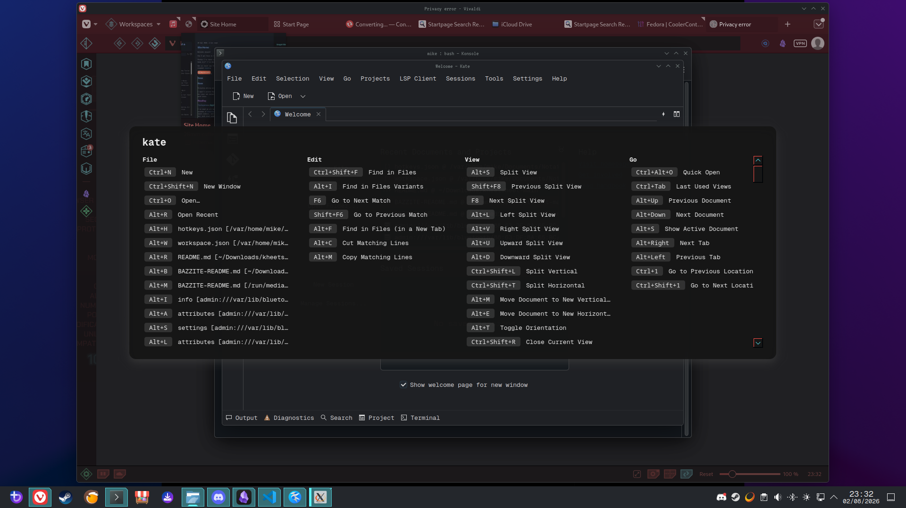

# KheetSheet

A KDE Plasma clone of the ([discontinued](https://www.mediaatelier.com/en/LandingCheatSheet/)) Mac app Cheatsheet.

![[KS0101README-1.png]]

The idea is that you press a hotkey, and see the focused app's keyboard shortcuts in an overlay, grouped by menu. Shortcut data comes entirely from AT-SPI (the accessibility tree) which has some limitations. If an app *doesn't* expose its menu via AT-SPI (many GTK4/Electron apps), you'll get a simple "no shortcuts found". I've not been able to find a workaround that wasn't super creepy or likely to serve stale data. Or both. Yet?

> I have an idea for Obsidian, but it'd mean accessing the vault to read custom & plugin keybinds and might not get anywhere. Stay tuned?

Many GTK4 apps *do* institute their own version though, `CTRL+?` (Or `CTRL+SHIFT+/`) will bring up *their* native overlay.

More on reasoning/thoughts without clogging this up any more than it already is live [here](https://28mm.coffee/the-reasoning-behind-kheetsheet)

## AI Disclosure

I, the human writing *this*, barely touched the actual code, that's all Clanker. If that grinds your gears, this may not be for you, but hopefully we can all move on with our lives.

## Screenshots

| Real shortcuts (Dolphin) | App with no AT-SPI menu (VS Code) |
| --- | --- |
|  |  |

## Demo

Toggling the overlay live over Konsole, Dolphin, and Kate, real shortcuts pulled from each app's own AT-SPI tree:

| Konsole | Dolphin | Kate |
| --- | --- | --- |
|  |  |  |
